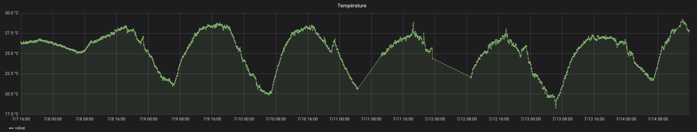

# xiaomi-mijia-bluetooth-to-prometheus
A Python3 webserver aimed for Linux, exposing Oregon temperature probes handled by Domoticz in the Prometheus format.

[](https://travis-ci.com/sdenel/xiaomi-mijia-bluetooth-to-prometheus)

An example with Grafana reading the Prometheus DB:




# Installation

The first step is associate the probe to your server with Domoticz.

## Running the webserver
* Put your own Domoticz URL in DOMOTICZ_URL
* Launch the web server as a background task, using tmux for example:
```bash
# Tip: Ctrl+b, d to detach the session
tmux new -s oregon-temperature-probe-to-prometheus "./webserver.py"
```

## Configuring Prometheus
Example of job configuration, with Prometheus in a Docker container:
```yaml
  - job_name: "oregon-temperature-probe"
    static_configs:
    - targets: ["172.17.0.1:9192"]
```

# Tests
See also .travis.yml.
```bash
# pep install pycodestyle
pycodestyle --first webserver.py
python3 -m doctest -v webserver.py
```
